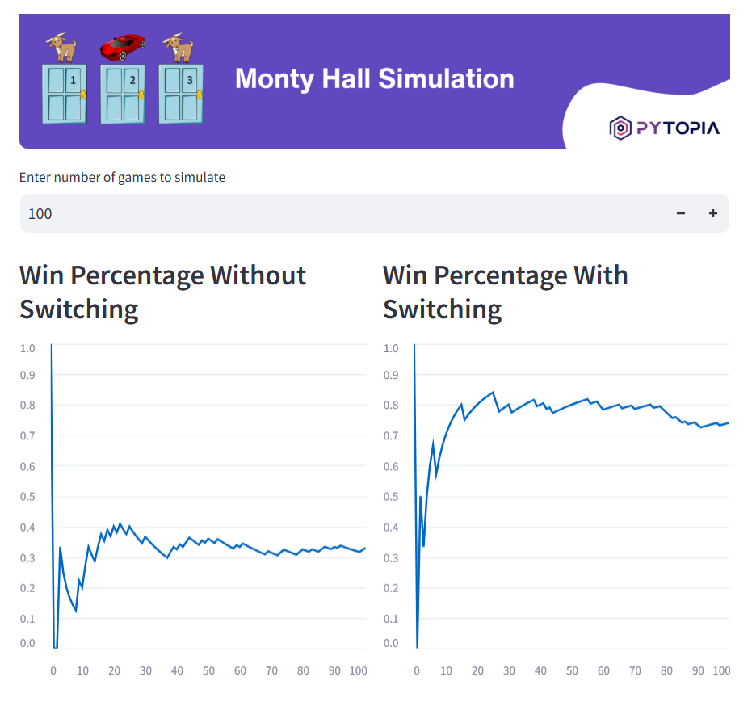

# Monty Hall Simulation

This project is designed for students who already have a firm grasp of Python programming. We will implement the Monty Hall Simulation Problem, allowing users to play the game through a terminal. Additionally, for those who are interested, an optional challenge is provided to generate a Streamlit dashboard for the game.

## The Monty Hall Problem
The Monty Hall problem is a famous statistical puzzle named after the original host of the game show 'Let's Make a Deal', Monty Hall. In this problem, a contestant is asked to choose one of three doors. Behind one door is a car and behind the other two doors are goats. After the contestant chooses a door, Monty, who knows what’s behind each door, opens another door which has a goat. The contestant is then given the chance to stick with the original choice or switch to the remaining unopened door. The question is: "Is it to the contestant’s advantage to switch his choice?"

## Project Structure
The project has the following directory structure:
```
.
├─ README.md
├─ requirements.txt
└─ src
   └─ monty_hall.py
   └─ app.py (optional)
```
- **src**: This directory contains the Python script (monty_hall.py) for the project.



## Requirements
- Python 3.7 or higher
- Streamlit (optional)

Use `pip install -r requirements.txt` to install necessary packages.


## Hints
Proceed in the following way:
- Understand the statistical concept governing the Monty Hall problem.
- Write a Python script to simulate the game in a terminal.
- Generate comprehensive tests to ensure your code runs as expected.
- Optional: Learn and use Streamlit to create an interactive dashboard.

## Learning Outcomes
By the completion of this project, you can expect to:
- Enhance Python programming skills, with a focus on interactivity.
- Develop a sound understanding of the Monty Hall problem and associated statistical principles.
- Be proficient in writing tests.
- Optionally, gain exposure to Streamlit - a powerful tool for creating interactive dashboards.

## Usage
Add the `src` directory to the `PYTHONPATH` and run the project's Python script with: `python src/monty_hall.py`

For Streamlit dashboard, run: `streamlit run src/app.py`
