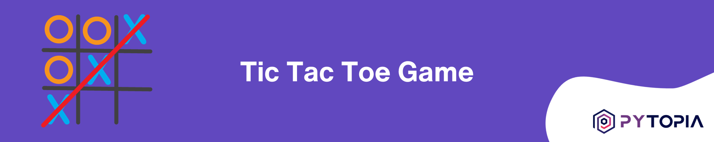

# Tic-Tac-Toe Python Project

## Description
This project is an implementation of the classic game Tic-Tac-Toe with Python. The players mark their spaces with an 'O' or an 'X' on a nine-square grid. The goal of the game is to mark three 'O's or 'X's diagonally, horizontally, or vertically. The game uses Python's object-oriented programming concepts to declare a TicTacToe class with properties and methods to represent the game's features. Moreover, the Python random module is used to randomly select the player to start the game.

## Project Structure 
The project is organized into a single Python file: tictactoe.py. This file contains the TicTacToe class along with its properties and methods. Here is a brief overview of this structure:
```
tictactoe.py
- TicTacToe Class
  - __init__ method: initializes the game board and other class attributes
  - print_board method: prints the current state of the game board
  - play method: enables a player to make a move
  - check_winner method: determines the winner of the game
```

## Requirements
- Python 3.x installed
- Basic understanding of Python programming and Object-oriented programming
- Optionally Streamlit if you wish to create a GUI

## Hints

- Represent the empty spaces in the board by filling them initially with numbers from 1 to 9.
- Use a 2-D list to represent the game board in Python.
- Draw the initial state of the board using a formatted string.
- Use a Python set to represent the remaining valid cells.
- Use the magic method __str__ to return the string representation of the game board state.

## Learning Outcomes
- Understanding the application of Python's object-oriented programming concepts
- Working with Python's random module
- Enhancing problem-solving skills
- Understanding the states and behavior of a system (game) and how to model/represent them in code
- Implementing a simple game logic
- Optionally creating a graphical user interface with Streamlit

## Future Enhancement
The game currently supports a text-based interface and can be enhanced to include a graphical user interface (GUI) using Streamlit. Other future potential enhancements could be creating a computer vs player mode and improving the overall user interface.
