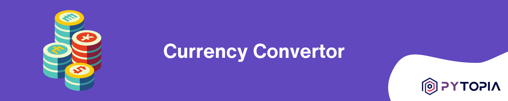
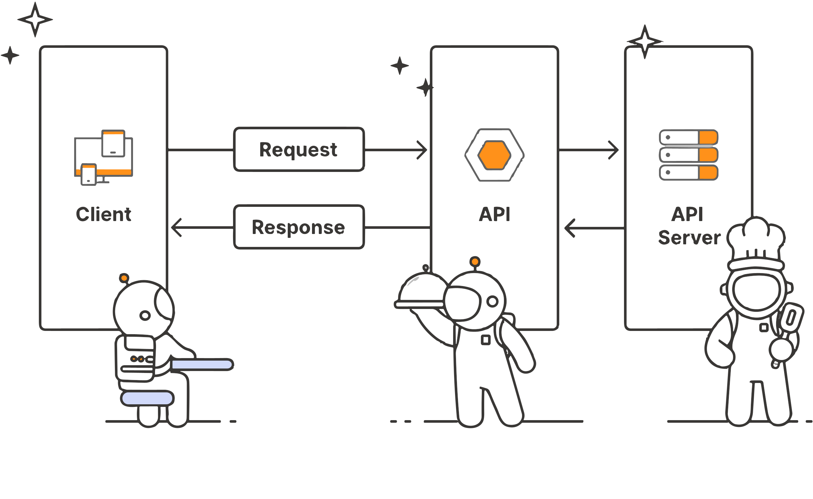

# Currency Converter Project

The Currency Converter Project is designed to be a practical application leveraging the Python programming language to create a tool that allows users to convert amounts between different currencies. This project utilizes the ExchangeRate-API for fetching real-time exchange rate data and provides an interface for users to specify the amount in one currency and get the equivalent amount in another currency. Additionally, the project features a user-friendly UI using Streamlit, making it accessible for non-technical users to perform currency conversions with ease.

A solution within this project is expected to deliver the following outcomes:

- **Currency Exchange Rate Retrieval**: Users should be able to input two currencies (e.g., USD and EUR) and retrieve the current exchange rate between them using the ExchangeRate-API.
- **Currency Conversion**: Given an amount in one currency, users should be able to convert it to the equivalent amount in another currency. The program will apply the latest exchange rates to perform this calculation.
- **Graphical User Interface (GUI)**: A Streamlit-based GUI that allows users to perform the above operations through a web interface. The GUI should be intuitive and user-friendly, enabling users with no technical background to use the application with ease.

In this project you will learn how to use Python to interact with REST APIs, parse JSON data, and perform currency conversion calculations. Learning how to use REST APIs is a valuable skill that can be applied to a wide range of projects.

## Requirements
To run this project, you will need the following:

- Python 3.x installed on your machine.
- An internet connection to access the ExchangeRate-API.
- An API key from https://api.exchangerate-api.com to authenticate requests.
- Installation of required Python libraries as listed in the `requirements.txt` file.

## Project Structure
The project is structured as follows:

- `README.md`: This file, which provides an overview of the project and instructions for setup and usage.
- `solutions/`: This directory contains multiple solution folders, each implementing the project with various approaches or added features.
  - `solution-1/`, `solution-2/`, etc.: Each solution directory contains:
    - `README.md`: A file describing the specific approach and any unique features of that solution.
    - `requirements.txt`: A file listing the dependencies required for that particular solution.
    - `src/`: A directory with all the source code related to that solution.

## Learning Outcome
By completing this project, learners will be able to:

- Understand and implement REST API calls in Python to fetch data from an external service.
- Parse and handle JSON data in Python.
- Perform currency conversion calculations using real-time exchange rates.
- Develop a basic UI using Streamlit to interact with Python scripts.
- Organize a Python project with multiple solutions and manage dependencies using `requirements.txt`.
- Apply best practices for writing readable and maintainable Python code.

## Future Enhancements
The project has been designed with expandability in mind. Future enhancements could include:

- Implementing caching of exchange rates to improve performance and reduce API calls.
- Extending the Streamlit UI to include historical exchange rate data and graphs.
- Adding functionality to alert users when an exchange rate reaches a certain threshold.
- Incorporating a database to store user queries and perform analytics.
