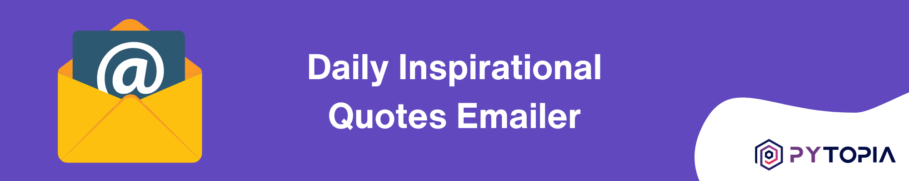

# Daily Inspirational Quotes Emailer

In the hustle and bustle of daily life, a small dose of inspiration can make a big difference. The Daily Inspirational Quotes Emailer is designed to automatically send a daily dose of motivation directly to your inbox. This Python-based project leverages the simplicity of sending emails with SMTP and the power of Python to bring daily inspiration to its users.

## Project Objective

The main goal of this project is to create a simple, automated system that sends out daily inspirational quotes to a list of subscribers. The project aims to:
- Fetch a random inspirational quote from a predefined list or an external API.
- Send this quote via email to all subscribers listed in a CSV file, personalizing each email with the recipient's name.
- Automate the process to ensure that the email is sent out at a specified time each day without manual intervention.

This project serves as an excellent opportunity for beginners and intermediate Python developers to work on a real-world application, enhancing their skills in automation, working with APIs, handling CSV files, and using SMTP for sending emails.

## Requirements

To get started with this project, you will need:
- **Python 3.x**: Ensure you have Python installed on your system. You can download it from [python.org](https://www.python.org/downloads/).
- **External Libraries**: Though Python's standard library includes most of the necessary modules (`smtplib`, `csv`, `email.mime`, etc.), you might need to install additional libraries if you decide to fetch quotes from an external API.
- **SMTP Server Information**: For sending emails, you need access to an SMTP server. This tutorial uses Gmail's SMTP server, but you can use others as per your preference. Ensure you have the necessary credentials (username and password or API key).
- **A CSV File of Subscribers**: Prepare a CSV file containing the names and email addresses of all the subscribers who will receive the daily inspirational quote.

## Future Enhancements

While the initial setup aims to fulfill the basic requirement of sending daily inspirational quotes, there are several potential enhancements that could make the project more robust and feature-rich:

- **Integration with Quote APIs**: Instead of using a predefined list of quotes, integrate with a third-party API to fetch a new and unique quote every day.
- **Customization Options**: Allow subscribers to set preferences for the type of quotes they receive (e.g., motivational, humorous, philosophical) and the frequency of emails (e.g., daily, weekly).
- **Subscriber Management**: Develop a web interface where users can subscribe or unsubscribe from the mailing list, update their preferences, and manage their subscription details.
- **Analytics**: Implement tracking and analytics to gauge the engagement level of subscribers, such as open rates and click-through rates of the emails sent.
- **Security Enhancements**: Incorporate more secure authentication methods for SMTP, such as OAuth, and explore ways to securely manage subscriber data.

This project not only provides a practical application of Python programming skills but also offers a platform for continuous learning and improvement as you explore and implement these enhancements.
