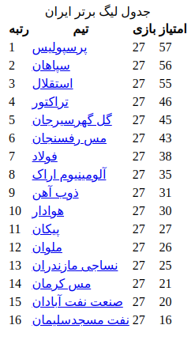

# Web Scraper
> DIFFICULTY: **INTERMEDIATE**

We are going to create a web scraper with Python that pulls a certain data from a website by extracting the tags from the HTML of it. Python has a built-in module, named **urllib**, for working with URLs. It send a request to the website and get the response object.

You need to use **BeautifulSoup** module to parsing the respone object which created by urllib. Parsing means taking a format like HTML and using a programming language to give it structure. For example, transforming data into an object. To start this task of creating a web scraper with Python, you need to install BeautifulSoup module. 

You need to creates a BeautifulSoup object, and pass the html variable and the “html.parser” string as a parameter.
Also you need to use 'UTF-8' encoder if the website is not in English.
The BeautifulSoup object does all the hard work and parses the HTML. Now you can extract the html tags which you need.

In this Python program we want to extract the table named 'جدول لیگ برتر ایران' from https://www.varzesh3.com website.

## TODO

1. Use **urllib** module to send a request to the website and get response object.
2. Parse the response by BeautifulSoup with **html.parser** and **UTF-8** encoding.
3. Find all html tags with 'league-standing' CSS class.
4. Write the result to a html file.

## Result

The ouput of this program is an html file as follows:

