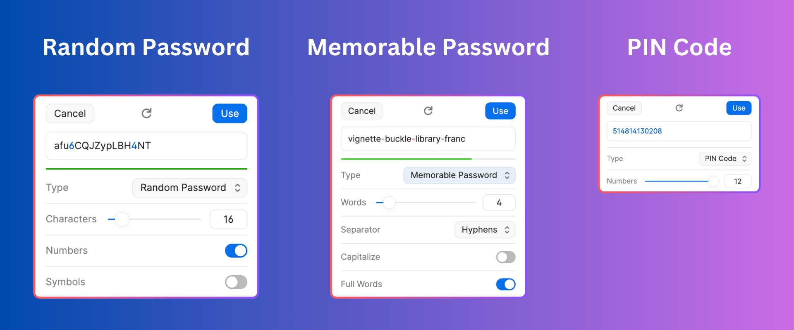

# Password Generator

This is a great project to get hands-on experience with Python, understanding object-oriented principles, and create a practical tool that generates various types of passwords.

## Objectives

Create a Python application that generates three types of passwords:

1. Random Passwords
2. Memorable Passwords
3. Pin Codes

## Requirements

Your application should have the following features:

1. A `RandomPasswordGenerator` that generates a completely random password of a specified length, optionally including numbers and symbols.
2. A `MemorablePasswordGenerator` that creates a password made up of a set number of randomly chosen words from the NLTK English language corpus. It should also optionally separate the words with a chosen separator and make the words capitalized.
3. A `PinCodeGenerator` that creates a numeric password of a specified length.
4. Each generator class should inherit from a base `PasswordGenerator` class and override the base class's `generate()` function to provide their unique password generation functionality.

## Steps

1. Understand the problem requirements and create a plan for your solution.
2. Create the `PasswordGenerator` base class with its `generate` method.
3. Implement the three password generators, making sure they all inherit from the base `PasswordGenerator` class.
4. The `PasswordGenerator` base class should not work on its own, but each subclass should function independently.
5. Test your project thoroughly, ensuring that all requirements are met.
6. Reflect on your solution, thinking about what you did well and what you could improve in the future.

## Hints

- Plan your solution before you start coding to get a good overview of what classes and methods you need.
- Make good use of Python's `random` and `string` modules.
- Consider how your classes can best follow the principles of object-oriented programming.

## Tools

- Python 3.6 or later
- NLTK (Natural Language Toolkit) - You will need this library for generating 'memorable' passwords.

## Deliverables

- The Python source code files
- A `README.md` file that explains how to run your program and what it does
- An optional report or presentation that explains your solution

**Bonus:** Create a user interface for your password generator!

## Evaluation

Your project will be assessed on the following:

- Functionality: Does the program work as intended?
- Code quality: Is the code easy to understand and maintain?
- Methodology: Have good software development methods been followed?
- Documentation: Is the project and its code appropriately documented?

## Learning Outcomes

- Deeper understanding of Python and object-oriented programming.
- Experience with library usage in Python.
- Understanding how to work with text and numbers to generate passwords.
- Grasp of random sampling.

We wish you all the best in your journey into Python programming with this practical project! Happy Coding!
