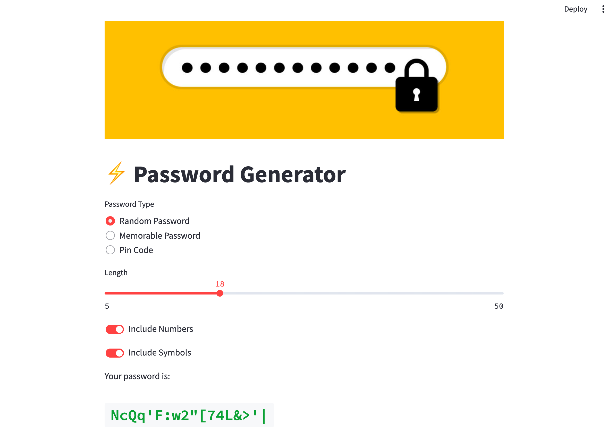

# Password Generator Dashboard

Welcome to the 'Password Generator Dashboard' project with Streamlit! This interactive web application provides users with the ability to generate different types of passwords based on their preferences. It incorporates three classes for password generation including `RandomPasswordGenerator`, `MemorablePasswordGenerator`, and `PinCodeGenerator`. You can find these classes in the `password_generator.py` module.

In this project, you will be expected to apply your knowledge of Streamlit to create a user-friendly dashboard interface for these password generators.



## Project Structure
The project has the following structure:

- `PasswordGenerator.py`: Python module containing the password generator classes.
- `app.py`: Python script to create a streamlit web app.
- `README.md`: Documentation of the project. You are currently here!

## Requirements

- Python 3.7+
- Streamlit
- NLTK (Natural Language Toolkit)

To install NLTK, use pip:

```bash
pip install nltk
```

After installing NLTK, you need to download the 'words' corpus. Run Python and type these commands:

```python
import nltk
nltk.download('words')
```

## Usage

You can run the Streamlit web app using the following command:
```sh
streamlit run app.py
```
This will run the web page at localhost. You can view this by opening your web browser and navigating to `http://localhost:8501/`.

## Project Requirements

### RandomPasswordGenerator:
This class should generate a random password of a specified length. It gives users the option to include numbers and symbols in their password.

### MemorablePasswordGenerator:
Generates a memorable password by combining a certain number of words together. Users can specify the separator, whether words should be capitalized, and provide their own list of vocabulary if they want.

### PinCodeGenerator
Generates a numeric pin of the specified length.

For all the above, users should be given the functionality to choose the type of password they want and to customize it further based on their choices. A good user interface is a key aspect of this project!


Good luck and happy coding!
