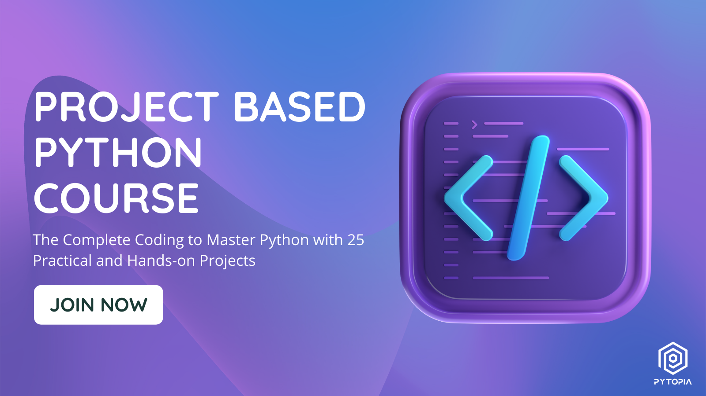

This is a collection of diverse Python projects, each with a project description, template code, difficulty level, and suggested Python packages for implementation. The goal of this repository is to provide inspiration, guidance, and support for Python learners and enthusiasts of varying skill levels. Whether you're a beginner or an experienced developer, there's something here for you!

# Learn with Us!
We offer a [course on these projects](https://www.pytopia.ai/courses/project-based-python) where learners can interact with peers and instructors, ask questions, and participate in online coding sessions. By registering for the course, you also gain access to our dedicated Telegram group. Enroll now and start learning!



# Project Levels & List
The projects are designed in three levels.


## Level I
  - Rock Paper Scissors
  - Password Generator
  - Streamlit Dashboard
  - Happy Numbers
  - Number to words
  - Monty Hall Simulation Problem
  - Tic Tac Toe
  - Sorting Algorithms
  - Directory Tree Generator
  - Contact Book

## Level II
  - Sending Email
  - Site Connectivity Checker
  - Wordle
  - Blogging Platform
  - Youtube Downloader
  - Currency Converter
  - Resize Image
  - Personal Homepage with Streamlit
  - Gender and Race Prediction from Name

## Level III
  - Web Scraper
  - News Information Extraction Scraper
  - Chatbot
  - Face Detection

Lastly, the grand capstone project: 
  - ChatGPT Customer Service.

# Getting Started
To start using the projects in this repository:

   - Clone the repo to your local machine: `git clone https://github.com/pytopia/project-based-python.git`
   - Navigate to the specific project directory and Start working on the project using the provided template code and following the project description.

# Project Structure
Each project in this repository is structured as follows:
```
  - project-name/
    - README.md
    - solutions/
      - solution-1/
      - solution-2/
      - solution-3/
    - additional-files (if any)
```
- `README.md`
Contains the project description, difficulty level, objectives, and any additional information needed to understand and complete the project.
- `solutions`
A directory containing one or more possible solutions for the project. Each solution is organized in a separate subdirectory with its own code, documentation, and any necessary additional files. Please note that these solutions are provided as examples, and there may be multiple ways to complete the project. Feel free to explore and create your own solutions!
- `additional-files`
Any additional files required for the project, such as data files, images, or configuration files.
